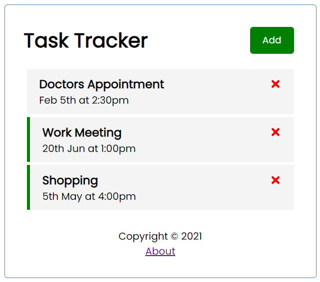

# Task Tracker

A simple task tracker app made using React as frontend and json server as backend 

## App Features

- Add tasks
- Delete tasks
- Double tap to set and remove reminder

## Requirements

- [Node and npm](https://nodejs.org/en/)
- [React](https://reactjs.org/)

## Installation

1. Clone the repository
2. Install node modules `npm install`
3. Start json server `npm run server`
4. Start the application `npm start`
5. View the application in browser at `http://localhost:3000`
6. View the db json file at `http://localhost:5000/tasks`

## Screenshots

